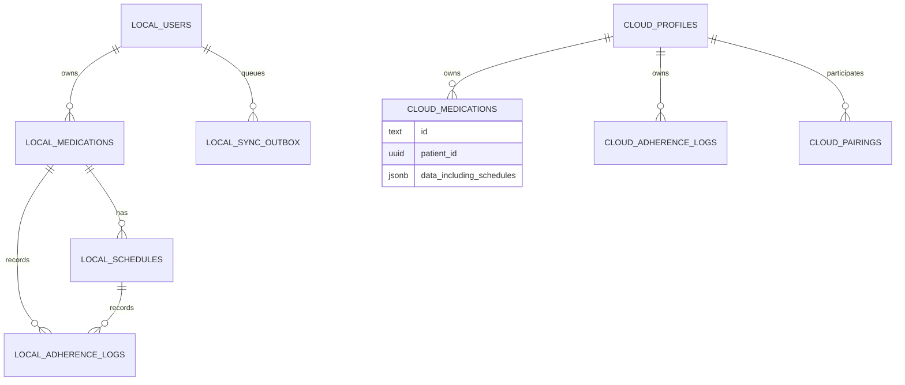

# MediSense data model (implementation snapshot)

Source of truth: `lib/data/database_helper.dart` for on-device SQLite and
`supabase/migrations/` for the hosted Postgres schema. This note describes the
implemented design; it is not evidence of benchmarked performance or regulatory
compliance.

## On-device SQLite

Database version 11 enables foreign keys on connection. The tables are:

| Table | Role and key relationships |
| --- | --- |
| `medications` | Medication details, keyed by text `id` and scoped by `user_id`. Expiry is nullable; rows support soft deletion through `is_active`. |
| `schedules` | Dose times, keyed by text `id`, with `medication_id` referencing `medications(id)` and `ON DELETE CASCADE`. Hour and minute have range checks. |
| `adherence_logs` | Recorded status (`taken`, `missed`, `pending`) and timestamp, with medication and schedule foreign keys. |
| `sync_outbox` | Pending cloud operations by `user_id`; stores JSON payload, attempt count, retry time, and last error. Medication writes and their outbox record share a SQLite transaction. |
| `users`, `guardian_pairs` | Local account and pairing records used by the app. |
| `medicines` | Imported medicine catalog used for lookup, separate from a patient's saved medications. |

Local indexes include schedule medication and active status, adherence timestamp
and medication, medication user, guardian/patient pair IDs, and outbox retry
time. No latency or throughput claim follows from the presence of an index.

## Hosted Supabase Postgres

| Table | Role |
| --- | --- |
| `profiles` | Account identity, role, tier, and subscription fields. Current select policy permits the account holder only. |
| `medications` | One row per patient and medication (`patient_id`, `id`); the `data` JSONB document embeds the medication attributes **and schedules**. There is no hosted `schedules` table. |
| `adherence_logs` | One row per patient and log (`patient_id`, `id`), with the event in `data` JSONB. |
| `pairings` | Guardian and patient IDs, emails, code, and acceptance status. |
| `payment_sessions`, `paymongo_events`, `password_resets` | Payment and account support records. |

Accepted guardian access to patient medication and adherence rows is enforced
by Postgres row level security policies. The pairing Edge Function performs
email lookup with a service role; client profile reads do not expose other
accounts. `medications` and `adherence_logs` are included in the Supabase
Realtime publication for foreground caregiver updates. Local outbox replay is
eventual and requires a valid session and network connection. The app has no
measured delivery bound or cross-device conflict resolution protocol.

